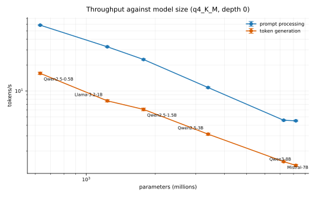
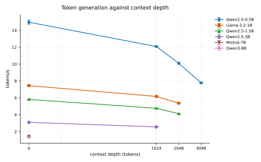
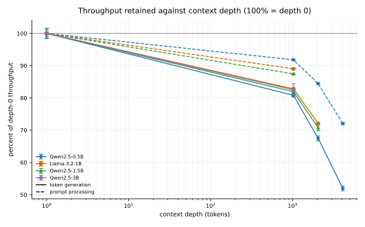

# llama.cpp on Mac Pro 3,1: model size and context depth

Second sweep on the same machine as `docs/build-macpro31.md`: models from 0.5B to 32B across nine
architectures, at context depths up to 4096 tokens, plus one pass over every GGUF file on the
machine. Build, portability fixes and the GPU situation are in that document; this one reports
measurements.

## Hardware

| Item | Value |
|---|---|
| CPU | 2x Xeon X5482 (Harpertown), 8 cores, SSE4.1, no AVX |
| RAM | 32 GiB |
| OS | OS X 10.11.6, Darwin 15.6 |
| Backend | CPU only, **7 threads** |

## Method

- `llama-bench` from the build produced by `scripts/build-macpro31.sh`; batch and ubatch at their
  defaults, Flash Attention `auto`, 7 threads. Seven rather than eight because eight worker threads
  on eight cores leave no headroom and generation collapses to about a third on this machine when
  anything else is runnable; the measurement is in [`build-macpro31-perf.md`](build-macpro31-perf.md).
- Six models, all Q4_K_M so that size is the main variable: Qwen2.5-0.5B, Llama-3.2-1B,
  Qwen2.5-1.5B, Qwen2.5-3B, Mistral-7B, Qwen3-8B.
- A prompt processing test is 128 tokens, a token generation test is 32 tokens. Depths of 1024 and
  above build a context of that many tokens before the test runs.
- **Interleaved schedule.** The run list is built as randomized rounds: each round holds every
  selected condition once, the order inside a round is shuffled, and no condition is ever placed
  next to itself, including across a round boundary. Every condition therefore appears once in each
  slice of the sweep, so a slow change on the machine is spread evenly across all conditions instead
  of biasing one. The realized order is committed as `macpro31/bench-all-plan.tsv`.
- **A quiet machine before every run.** Before each individual run the script waits until the CPU
  used by `rsync`, `backupd`, `mds`, `mdworker`, `MRT` and `fseventsd` is under 20 percent and the
  1-minute load average is under 12, then starts the run. The load limit matters as much as the CPU
  one on this machine: Spotlight indexes several external volumes and Time Machine periodically
  thins a 5.5 TiB backup volume, and both put the system into I/O wait without showing high CPU.
- Repeats: 4 per condition in the size sweep, 3 per condition in the depth and coverage sweeps. Each
  point is the mean of its runs and the error bar is one sample standard deviation, so bars show
  run-to-run spread rather than a confidence interval for the mean.
- Deep contexts cost real time: `llama-bench` rebuilds the depth context once for the prompt test and
  again for the generation test, so a 4096-token condition pays two 4096-token prefills. Where that
  is minutes of work, only the test of interest was run: generation only at 2048 and 4096 for the
  smaller models, and prompt processing at depth measured separately for Qwen2.5-0.5B. Each chart
  states which depths it covers.
- The depth-0 baseline for the deeper points comes from the size sweep, which measures the same
  models at depth 0 with 4 runs.
- **The whole suite was re-run at other thread counts.** 6, 5, 4, 3, 2 and 1 threads are measured in
  full; those records are `macpro31/bench-*-{6,5,4,3,2,1}t.jsonl`. 7 threads remains the baseline
  here, and the comparison is in "What thread count changes" below.

## Throughput against model size



| model | params | n | prompt t/s | sd | generation t/s | sd |
|---|---|---|---|---|---|---|
| Qwen2.5-0.5B | 0.63B | 4 | 58.46 | 0.78 | 16.05 | 0.52 |
| Llama-3.2-1B | 1.24B | 4 | 32.72 | 0.50 | 7.67 | 0.23 |
| Qwen2.5-1.5B | 1.78B | 4 | 23.27 | 0.38 | 6.10 | 0.21 |
| Qwen2.5-3B | 3.40B | 4 | 10.96 | 0.18 | 3.14 | 0.09 |
| Mistral-7B | 7.25B | 4 | 4.56 | 0.07 | 1.50 | 0.03 |
| Qwen3-8B | 8.19B | 4 | 4.49 | 0.08 | 1.36 | 0.03 |

## Token generation against context depth



| model | depth | n | t/s | sd | retained |
|---|---|---|---|---|---|
| Qwen2.5-0.5B | 0 | 4 | 16.05 | 0.52 | 100.0% |
| Qwen2.5-0.5B | 1024 | 3 | 12.65 | 0.52 | 78.8% |
| Qwen2.5-0.5B | 2048 | 3 | 10.47 | 0.37 | 65.2% |
| Qwen2.5-0.5B | 4096 | 3 | 8.32 | 0.31 | 51.8% |
| Llama-3.2-1B | 0 | 4 | 7.67 | 0.23 | 100.0% |
| Llama-3.2-1B | 1024 | 3 | 6.31 | 0.18 | 82.2% |
| Llama-3.2-1B | 2048 | 3 | 5.48 | 0.17 | 71.5% |
| Qwen2.5-1.5B | 0 | 4 | 6.10 | 0.21 | 100.0% |
| Qwen2.5-1.5B | 1024 | 3 | 5.09 | 0.16 | 83.6% |
| Qwen2.5-1.5B | 2048 | 3 | 4.43 | 0.14 | 72.8% |
| Qwen2.5-3B | 0 | 4 | 3.14 | 0.09 | 100.0% |
| Qwen2.5-3B | 1024 | 3 | 2.71 | 0.07 | 86.5% |
| Mistral-7B | 0 | 4 | 1.50 | 0.03 | 100.0% |
| Qwen3-8B | 0 | 4 | 1.36 | 0.03 | 100.0% |

## Prompt processing against context depth


| model | depth | n | t/s | sd | retained |
|---|---|---|---|---|---|
| Qwen2.5-0.5B | 0 | 4 | 58.46 | 0.78 | 100.0% |
| Qwen2.5-0.5B | 1024 | 3 | 53.00 | 1.24 | 90.7% |
| Qwen2.5-0.5B | 2048 | 3 | 48.69 | 0.86 | 83.3% |
| Qwen2.5-0.5B | 4096 | 3 | 42.16 | 0.07 | 72.1% |
| Llama-3.2-1B | 0 | 4 | 32.72 | 0.50 | 100.0% |
| Llama-3.2-1B | 1024 | 3 | 28.96 | 0.45 | 88.5% |
| Qwen2.5-1.5B | 0 | 4 | 23.27 | 0.38 | 100.0% |
| Qwen2.5-1.5B | 1024 | 3 | 20.47 | 0.34 | 88.0% |
| Qwen2.5-3B | 0 | 4 | 10.96 | 0.18 | 100.0% |
| Mistral-7B | 0 | 4 | 4.56 | 0.07 | 100.0% |
| Qwen3-8B | 0 | 4 | 4.49 | 0.08 | 100.0% |

## Throughput retained



Solid lines are token generation, dashed lines are prompt processing, and 100 percent is each
model's own depth-0 figure.

## Depth 0 against depth 2048


## Every model file on the machine

`scripts/bench-macpro31.sh coverage` walks every `*.gguf` in `MODELS_DIR` at depth 0, so the chart and
table below answer "how does each file actually run" rather than following the six-model comparison
above. The duplicates that differ only in quantization are included on purpose: they are what is on
the disk. 22 files, 3 runs each.


| model | prompt t/s | sd | generation t/s | sd |
|---|---|---|---|---|
| stories260K (toy) | 18690.30 | 410.91 | 3849.94 | 315.68 |
| Qwen2.5-0.5B f16 | 13.52 | 0.27 | 5.44 | 0.16 |
| Qwen2.5-0.5B q4_0 | 70.29 | 1.19 | 16.70 | 0.73 |
| Qwen2.5-0.5B q4_K_M | 57.95 | 0.99 | 15.63 | 0.61 |
| Qwen2.5-0.5B q8_0 | 56.34 | 0.74 | 11.45 | 0.26 |
| Llama-3.2-1B q4_K_M | 32.51 | 0.46 | 7.61 | 0.23 |
| SmolLM2-1.7B (llama) | 19.13 | 0.36 | 5.66 | 0.23 |
| R1-Distill-Qwen-1.5B | 23.29 | 0.53 | 6.12 | 0.24 |
| Qwen2.5-1.5B q4_0 | 20.42 | 0.31 | 6.15 | 0.23 |
| Qwen2.5-1.5B q4_K_M | 23.35 | 0.36 | 6.10 | 0.18 |
| granite-3.1-2b | 12.69 | 0.19 | 3.89 | 0.14 |
| gemma-2-2b-it | 15.10 | 0.24 | 3.48 | 0.12 |
| Falcon3-3B | 13.06 | 0.09 | 3.54 | 0.07 |
| Qwen2.5-3B q4_K_M | 10.96 | 0.19 | 3.16 | 0.10 |
| Phi-3.5-mini | 4.94 | 0.08 | 2.48 | 0.06 |
| Mistral-7B q4_0 | 4.07 | 0.10 | 1.61 | 0.07 |
| Mistral-7B q4_K_M | 4.52 | 0.06 | 1.47 | 0.04 |
| OLMo-2-7B | 4.83 | 0.09 | 1.50 | 0.04 |
| aya-expanse-8b | 4.49 | 0.07 | 1.25 | 0.04 |
| Qwen3-8B q4_K_M | 4.47 | 0.08 | 1.34 | 0.04 |
| Qwen2.5-14B q4_K_M | 2.35 | 0.04 | 0.75 | 0.02 |
| Qwen2.5-32B q4_K_M | 0.99 | 0.02 | 0.34 | 0.01 |

`stories260K` is a 1.1 MB toy model included because it is on the disk; its numbers only show that
the harness itself has no fixed overhead worth worrying about.

- **Every architecture on the disk loads and runs.** The set spans `llama` (Llama-3.2, SmolLM2,
  Mistral), `qwen2`/`qwen3` (Qwen, DeepSeek R1 distill), `phi3` (Microsoft Phi-3.5), `granite` (IBM),
  `gemma2` (Google), `olmo2` (AllenAI), `command-r` (Cohere aya) and `falcon` (TII), and none needed a
  build change. That is a compatibility result as much as a speed one: this CPU has SSE4.1 and no AVX,
  so every path taken here is scalar or SSE code.
- **Generation is uniformly at the memory ceiling.** Reading every weight once per token gives 5.9 to
  7.8 GB/s across all 22 files, whatever the family. Throughput is set by file size and nothing else,
  which is why a 1.7B SmolLM2 and a 1.7B Qwen2.5 land within 8 percent of each other.
- **Prefill usually lands in the 66 to 83 GFLOP/s band, and two architectures fall short of it.**
  Phi-3.5-mini manages 2 x 3.8B x 4.94 = 37 GFLOP/s, and granite-3.1-2b about 51. Qwen, Llama,
  Gemma-2, OLMo-2, Falcon3, SmolLM2 and aya all sit in the band. Same CPU, same quantization, same
  threads, so the shortfall is the model's graph and kernel layout rather than the machine.
- **Practical read**: the 0.5B to 1.5B models are interactive (5.4 to 16.7 tokens/s generation), the
  3B class is marginal, and everything from 7B up is batch-only.

## What thread count changes

The whole suite was re-run at 6, 5, 4, 3, 2 and 1 threads over the same 22-model set. Seven down to
two are committed (`bench-coverage.jsonl` and `bench-coverage-{6,5,4,3,2}t.jsonl`); one thread was
still running when this was written.


Across the 21 real models (the toy is excluded), as a percentage of the 7-thread rate:

| threads | prefill median | prefill range | generation median | generation range | thread ratio |
|---|---|---|---|---|---|
| 6 | 88.0% | 85.7-88.9% | 98.1% | 93.9-106.9% | 85.7% |
| 5 | 73.8% | 72.7-74.9% | 89.2% | 83.5-104.2% | 71.4% |
| 4 | 59.7% | 58.9-60.8% | 78.3% | 72.4-102.6% | 57.1% |
| 3 | 45.0% | 44.4-46.3% | 63.8% | 57.3-83.2% | 42.9% |
| 2 | 30.2% | 29.7-31.4% | 47.0% | 40.8-65.5% | 28.6% |

Representative absolute figures, tokens/s:

| model | test | 7t | 6t | 5t | 4t | 3t | 2t |
|---|---|---|---|---|---|---|---|
| Qwen2.5-0.5B q4_0 | prefill | 70.29 | 61.39 | 51.63 | 42.13 | 31.81 | 21.51 |
| Qwen2.5-0.5B q4_0 | generation | 16.70 | 17.64 | 17.07 | 17.14 | 13.89 | 10.32 |
| Qwen2.5-0.5B q4_K_M | prefill | 57.95 | 49.65 | 42.57 | 34.34 | 26.01 | 17.59 |
| Qwen2.5-0.5B q4_K_M | generation | 15.63 | 15.59 | 14.67 | 13.05 | 10.72 | 8.16 |
| Qwen2.5-3B | prefill | 10.96 | 9.69 | 8.15 | 6.62 | 4.96 | 3.35 |
| Qwen2.5-3B | generation | 3.16 | 3.10 | 2.84 | 2.48 | 2.03 | 1.49 |
| Qwen3-8B | prefill | 4.47 | 3.95 | 3.31 | 2.68 | 2.01 | 1.35 |
| Qwen3-8B | generation | 1.34 | 1.29 | 1.20 | 1.04 | 0.85 | 0.62 |
| Qwen2.5-32B | prefill | 0.99 | 0.87 | 0.73 | 0.59 | 0.44 | 0.30 |
| Qwen2.5-32B | generation | 0.34 | 0.32 | 0.30 | 0.26 | 0.21 | 0.15 |

- **Prefill tracks the thread count and beats it slightly.** The medians sit 1-2 points above the
  thread ratio at every count (88.0 against 85.7, 73.8 against 71.4, 59.7 against 57.1, 45.0 against
  42.9, 30.2 against 28.6), and the spread across 21 models and nine architectures stays under 1.7
  points. That is what a purely compute-bound test looks like: the only variable is how many cores
  are working, with less per-thread contention as the count falls.
- **Generation is sublinear because it is bandwidth bound.** 98.1, 89.2, 78.3, 63.8 and 47.0 percent
  at 6, 5, 4, 3 and 2 threads. From 6 down to 3 those numbers track `sqrt(threads / 7)` closely
  (predicted 92.6, 84.5, 75.6, 65.5), which is the shape of a memory system that saturates before the
  cores do. At 2 threads the measurement falls below that curve (47.0 against 53.5), so the fit is a
  guide rather than a law.
- **The spread in generation is the format effect, not noise.** At 4 threads the range is 72 to 103
  percent: `q4_0` is unchanged from 7 threads (17.14 against 16.70) and `q8_0` keeps 92 percent,
  while `f16` falls to 74 percent and keeps falling (60 percent at 3, 45 at 2). Formats whose kernels
  need less bandwidth per token keep their speed when cores are removed.
- **Six threads is the sweet spot on a machine that is somebody's desktop.** 98 percent of the
  7-thread generation rate for 88 percent of the prefill, with two cores left for the desktop. The
  8-thread collapse documented in `build-macpro31-perf.md` is why "one more than 6" is not an option.
- The 1-thread count will be added when its run finishes.

## What the numbers say## What the numbers say## What the numbers say

- **Prompt processing delivers a nearly constant number of operations per second.** Throughput
  falls from 58.5 to 4.49 tokens/s across a 13x range of model size, and the product with two
  operations per parameter stays in one band:

  | model | params | prompt t/s | effective GFLOP/s |
  |---|---|---|---|
  | Qwen2.5-0.5B | 0.63B | 58.46 | 73.7 |
  | Llama-3.2-1B | 1.24B | 32.72 | 80.9 |
  | Qwen2.5-1.5B | 1.78B | 23.27 | 82.7 |
  | Qwen2.5-3B | 3.40B | 10.96 | 74.4 |
  | Mistral-7B | 7.25B | 4.56 | 66.0 |
  | Qwen3-8B | 8.19B | 4.49 | 73.6 |

  About 66 to 83 GFLOP/s, so the rough rule here is `prompt tokens/s ~ 75 / (2 x params in
  billions)`. The pre-SSSE3 builds on this machine managed 21-26 GFLOP/s, so the kernel work is
  most of the difference.
- **Generation is bandwidth bound and sits at the measured ceiling.** Reading every weight once per
  token, the effective read rate is 7.8 GB/s at 0.5B, 6.1 at 1B, 6.8 at 1.5B, 6.6 at 3B, 6.6 at 7B
  and 6.8 at 8B, against 7.14 GB/s for a pure 8-thread streaming read: the small model slightly
  exceeds that probe, the rest sit at 85-95 percent of it. The flatness over a 40x range of model
  size, 0.49 GB to 19.85 GB, is the whole story of generation on this machine.
- **Depth hurts generation much more than prompt processing.** At 1024 tokens generation retains
  79 to 86 percent while prompt processing retains 88 to 91 percent. At 4096 on Qwen2.5-0.5B,
  generation is down to 52 percent while prompt processing holds 72 percent. The attention pass
  reads the KV cache on every generated token, and that read grows with the context; prompt
  processing pays it once.
- **Format matters less than it used to.** With SSSE3 kernels for both, q4_0 leads q4_K_M by 23
  percent on 0.5B prefill but is level or slightly behind on the larger models. Generation is within
  a few percent either way, and q4_0 wins at 7B because the file is 7 percent smaller. The old 4.4x
  penalty for q4_K_M is gone.
- **This machine's practical ceiling is the 1.5B to 3B range.** 5.4 to 6.6 tokens/s is usable for
  interactive work, and 2.7 at 3B with a 1024-token context is marginal but alive. Mistral-7B at
  1.50 and Qwen3-8B at 1.36 tokens/s are batch-only. Prompt processing at 4.5 tokens/s for a 7B or
  8B model means a 1000-token prompt needs about four minutes before the first token, against the
  12 minutes the OpenMP build took.
- **Beyond 8B the machine still works, but leaves interactive use behind.** The 14B generates at
  0.75 tokens/s and the 32B at 0.34, with prefill of 2.35 and 0.99 tokens/s, so a 1000-token prompt
  costs about 7 minutes on the 14B and 17 minutes on the 32B before the first token. The 32B fits in
  32 GiB only because llama.cpp maps the weights from disk.
- The two sweeps agree where they overlap: Qwen2.5-0.5B prompt processing at depth 1024 was 53.33 in
  the context sweep and 53.00 in the depth sweep.

## Reproducing the numbers

```
scripts/build-macpro31.sh
MODELS_DIR=~/models THREADS=7 scripts/bench-macpro31.sh all
python3 scripts/plot-macpro31-large.py \
    docs/macpro31/bench-scale.jsonl docs/macpro31/bench-depth.jsonl docs/macpro31
python3 scripts/plot-macpro31.py \
    docs/macpro31/bench-context.jsonl docs/macpro31/bench-quant.jsonl docs/macpro31
python3 scripts/plot-macpro31-coverage.py docs/macpro31/bench-coverage.jsonl docs/macpro31

# other thread counts, then the comparison
MODELS_DIR=~/models THREADS=6 OUT=~/bench-macpro31-r6.jsonl scripts/bench-macpro31.sh all
python3 scripts/plot-macpro31-threads.py docs/macpro31 \
    7t=docs/macpro31/bench-coverage.jsonl 6t=docs/macpro31/bench-coverage-6t.jsonl
```

The sweep is resumable: conditions already listed in the done file are skipped, so an interrupted
sweep continues where it stopped.
